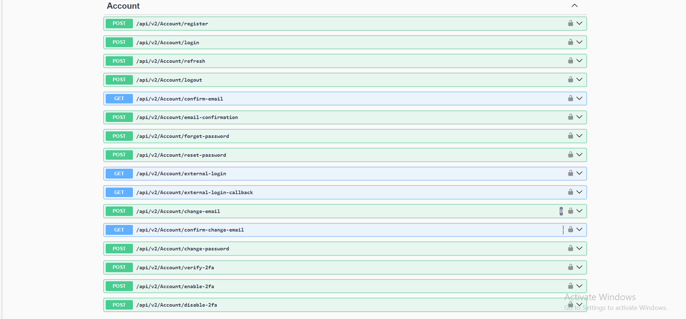
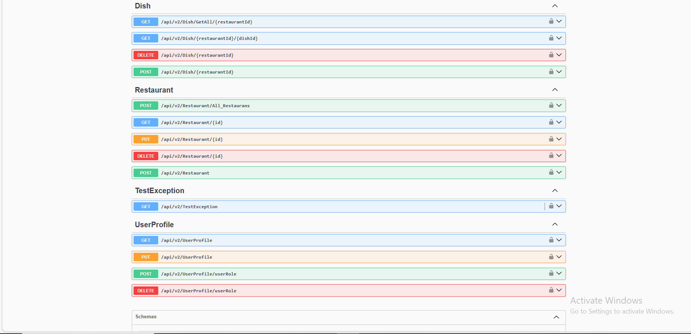
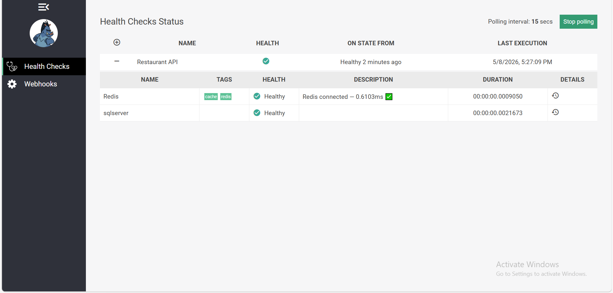
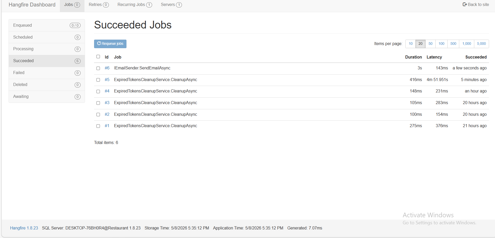

# 🍽️ Restaurant API – Clean Architecture (.NET)

A **production-ready Restaurant Management System API** built with **ASP.NET Core**, following **Clean Architecture + CQRS + MediatR** principles.  
The project is designed to be **scalable, maintainable, and enterprise-grade** using modern backend engineering practices.

---

## 🚀 Project Overview

This system provides a full-featured backend for managing restaurants, dishes, users, authentication, caching, background jobs, and system monitoring.

It demonstrates real-world backend engineering skills including:

- Clean Architecture layering
- CQRS + MediatR pattern
- Repository + Unit of Work Pattern
- Specification Pattern for advanced querying
- Result Pattern
- JWT Authentication + Refresh Tokens
- Google External Login
- Redis Caching
- Hangfire Background Jobs
- Rate Limiting
- Health Checks (SQL + Redis)
- Middleware pipeline customization
- Role-based Authorization
- FluentValidation for request validation
- AutoMapper for object mapping
- Advanced logging with Serilog
- Advanced data handling with Pagination, Sorting, and Filtering

---

## 🏗️ Architecture

The solution is structured into 4 main layers:

- API Layer (Restaurant_Project) → Controllers, Middleware, Program.cs  
- Application Layer → Business logic (CQRS Handlers, Validators, Mapping Profiles)  
- Domain Layer → Entities, DTOs, Specifications, Core abstractions  
- Infrastructure Layer → Data access, Repositories, Unit of Work, EF Core, Redis, Seeders  

---

## ⚙️ Key Features

### 🔐 Authentication & Authorization

The system provides a complete and secure identity management module built with ASP.NET Core Identity and JWT.

#### 🧾 Core Authentication Features

- JWT Authentication
- Refresh Token System
- Login / Register System
- Logout Functionality
- Role-based Authorization (Admin / Owner / User)

---

#### 📧 Email & Account Verification

- Email Confirmation Flow
- Forget Password Flow
- Reset Password with secure token
- Change Email with confirmation
- Confirm Email Change

---

#### 🔐 Security Features

- Password Change functionality (authenticated users)
- Account lockout & identity protection (via Identity)
- Secure token-based operations for all sensitive actions

---

#### 🌐 External Authentication

- External Login (Google OAuth)
---

#### 🧠 Two-Factor Authentication (2FA)

- Enable Two-Factor Authentication
- Disable Two-Factor Authentication
- Verify 2FA code during login process

---

### 🏪 Restaurant Management

- Create / Update / Delete Restaurants  
- Get All Restaurants with Pagination, Sorting, and Filtering using Specification Pattern  
- Get Restaurant by ID (Cached)

---

### 🍽️ Dish Management

- Add / Remove / Get Dishes per Restaurant

---

### ⚡ Performance & Optimization

- Redis Caching (GET optimization)
- Cache Invalidation on Update/Delete
- Rate Limiting (IP-based)
- Concurrent Request Handling Middleware

---

### 🔄 Background Processing

- Hangfire Dashboard
- Scheduled Jobs (e.g., cleaning expired refresh tokens)

---

### 🧠 Health Monitoring

- SQL Server Health Checks
- Redis Health Checks
- Health Check Dashboard

---

### 🛡️ Middleware Pipeline

- Global Exception Handling Middleware
- Request Logging Middleware
- Blacklisted Token Middleware
- Request Timing Middleware

---

## 🧱 Design Patterns & Best Practices

### Repository Pattern
Abstracts data access logic from business logic.

### Unit of Work Pattern
Manages transactions across multiple repositories.

### Specification Pattern
Enables reusable, dynamic querying (filtering, sorting, pagination).

### CQRS Pattern
Separates read and write operations using MediatR.

### AutoMapper
Maps between Entities and DTOs cleanly.

### FluentValidation
Handles request validation in a clean and scalable way.

---

## 🧪 Validation Layer (FluentValidation)

- Strong input validation before business logic execution
- Clean separation of validation rules
- Reusable validation components

---

## 🧠 Mapping Layer (AutoMapper)

- Entity ↔ DTO mapping
- Request ↔ Domain mapping
- Reduces boilerplate code

---

## 📸 Project Screenshots

### 1️⃣ System Overview  

### 3️⃣ Health Check Dashboard

### 4️⃣ Hangfire Dashboard  

---

## 🧱 Technologies Used

- ASP.NET Core Web API
- Entity Framework Core
- SQL Server
- Redis
- MediatR
- AutoMapper
- FluentValidation
- Hangfire
- Serilog
- JWT Authentication

---

## 🌟 Highlights

- Enterprise-level backend architecture
- Fully scalable and modular design
- Clean separation of concerns
- Advanced querying system (Specification Pattern)
- Strong validation layer (FluentValidation)
- Clean mapping layer (AutoMapper)
- High performance with Redis caching
- Secure authentication system
- Production-ready middleware pipeline
- Background job automation with Hangfire
- Advanced data handling with Pagination, Sorting, and Filtering

 ---
 
👨‍💻 Author

Built as a backend engineering portfolio project demonstrating advanced .NET development skills, Clean Architecture, and enterprise design patterns.

